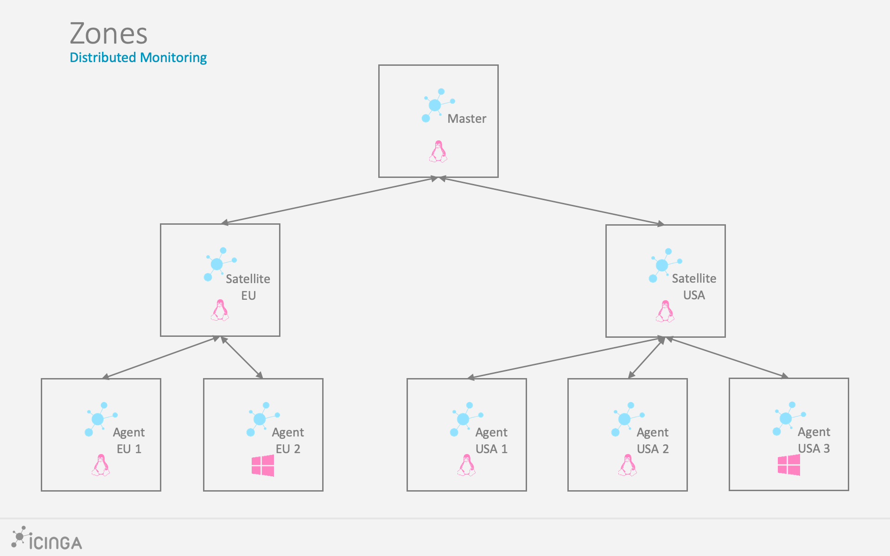

## Project Proposal (submitted 3/2/2022)

### Goal Summary

For my final project I would like to use and become proficient with formal verification and nuXmv symbolic model checking with particular focus on [Icinga 2](https://icinga.com/docs/icinga-2/latest/doc/01-about/), a network monitoring and alerting system with which I am familiar because of my responsibilities at College of Charleston. This system is one that can (and should) be decomposed into core components, each with their own specifications, states, and transitions such that they can be modeled as synchronous finite-state machines, and consequently checked with a symbolic model checker like nuXmv.

### Reasoning & Context

With this project, my goal is to learn how to navigate and apply nuXmv proficiently in the context of a domain that I am interested in and that I have been working in since 2019 at the College of Charleston. We use (and I manage) [Icinga 2](https://icinga.com/docs/icinga-2/latest/doc/01-about/) as one of our primary systems for network infrastructure monitoring and alerting, and I want to use an instance of [Icinga 2](https://icinga.com/docs/icinga-2/latest/doc/01-about/) (now that I am familiar with its architecture) as a focal point/basis to do the following:

1. First and foremost, apply knowledge/skills covered in class to develop formal specifications and
   models for a network monitoring and alerting system, or specific components of said system. I may
   abstract some of the architectural details of Icinga 2 away from the problem for simplicity.
2. Apply nuXmv knowledge/skills covered in class to symbolically model such a system/component to
   verify that the system meets some specification(s).

### Foundation - Icinga Architecture

To give some clarification, Icinga 2 is a distributed system for network monitoring and alerting that follows a [hierarchical architecture based on zones and roles](https://icinga.com/docs/icinga-2/latest/doc/06-distributed-monitoring/). Take the following example:

The above architecture has one **Master node** on top of the hierarchy (in a Master zone), and two **Satellite** nodes (children of the master), where the left Satellite belongs to **Zone EU** (call it EU-S1 for the first satellite in Zone EU) and the right satellite belongs to Zone USA (call this one USA-S1).

#### Components

As mentioned above, since a system like Icinga 2 is distributed and complex, it makes more sense to focus on the core components of the system for the purpose of formal verification. Let's consider some of these components below.

##### Agent

An agent is a service running on a host somewhere that listens (constantly) for requests from satellites
for information about its host, e.g. CPU usage, disk space, memory usage, service statuses, etc. It then
accesses and sends that information back to the requestor. In the case of an agent like [NCPA (Nagios Cross Platform Agent, a free monitoring agent for Linux, Windows, and Mac)](https://www.nagios.org/ncpa/), running the agent on a host opens an NCPA API (behind token authentication) on some port that the satellite can hit to pull monitoring information about the host and its services. So, one can already see that even just the Agent component can be considered a fairly complex transition system to be modeled.

##### Satellite

Each of the satellites is responsible for sending periodic checks (upon receiving check commands from
the master, where the intervals are user-defined) to the child agents (e.g. each NCPA agent running on each host in some zone) and returning the results of those checks to the master. So, at a high level, we have some number N of satellites, with each satellite receiving commands, acting on those commands, and returning information to the commander (the master).

##### Host Check

A Host check is really just a check to ensure that a host is still alive, which equates to a ping against the target host. Each host runs an agent, e.g. NCPA for this case study. This kind of check runs against all hosts, at a frequency of 1 check per minute. Each host has an address (domain name or IP) and belongs to some zone in the hierarchy, e.g. USA in the above pictured example. The zone of the host tells the master which satellite is responsible for that host and thus which satellite to send the hostalive (ping) check command to for execution. E.g. Master would send a hostalive check command to the USA satellite for execution against the USA 1 host (agent).

##### Service Checks

When you monitor services in Icinga 2, you need to configure service checks for the services that you want to monitor. In a nutshell, when you set up a service check, you're not just checking if a host is up or down, you're checking whether that host is either running something correctly or performing as expected. A service check has the following important attributes for this analysis:

- a check command; this is the actual command that gets executed against the target host being monitored; ex: this could be an invocation of the host's NCPA api to get a particular attribute like current disk usage
- a check frequency
- whether it's disabled
- assignment rules - the service check may be assigned to specific hosts matching some criteria, e.g. host name == "_database-server_"; this of course tells the master which hosts to target for the service check. Since each host belongs to some zone, e.g. USA as in the above example, and a given Satellite(s) is responsible for said zone, this tells the master which satellite to send the check command to.

##### Master

With great resource allocation comes great responsibility. The master is in charge of a ton, but for this
instance, we’ll focus on the following:

- Based on configured check intervals for each given host/agent (user-defined), the master must send
  periodic check commands to the satellite responsible for monitoring that host/agent; configuration includes check frequency, commands to execute, whether a downtime is active, and much more.
- For each check result returned about a given host/agent, the master processes and saves it, and if
  necessary, sends alerts to any configured contacts for that agent if any configured thresholds are met.
  Note that these thresholds are technically indicators of bad states, but those bad states are not bad
  states for Icinga 2 as a system, so we will not consider these thresholds as such. Also, since it is irrelevant
  what is being monitored for this model, it is irrelevant what the thresholds are, so those can be
  abstracted into a condition like <alert*threshold_met?>. However, we would be interested in three types
  of alerts: warning, critical, and unknown, so these will arise in the modeling. \_Note that with Icinga 2, the master also runs a web server ([Icinga Web 2](https://icinga.com/docs/icinga-web-2/latest/doc/01-About/#:~:text=Icinga%20Web%202%20is%20a,and%20easily%20extensible%20with%20modules.)) for front-end accessing and viewing of monitoring data about hosts and services, but we're going to abstract that part of the architecture away as the web app runs independently of the monitoring and alerting functionality.*

##### Database / [Icinga DB](https://icinga.com/docs/icinga-2/latest/doc/14-features/#icinga-db)

Of course, the system also needs to store check results efficiently and reliably for historical viewing by system administrators. This means when the master receives check results, those check results need to end up in an accessible database. As outlined in [the docs](https://icinga.com/docs/icinga-2/latest/doc/14-features/#icinga-db), Icinga 2 provides the `icingadb` feature that stores monitoring data in a [Redis](https://redis.io) in-memory database (this is the efficiency part). The [IcingaDB service](https://github.com/icinga/icingadb) works continously to collect and sync that in-memory database with a persistent backend MySQL database (this provides the reliability). This is another example of a core component with some significant complexity.

### Planning

It would be impractical to try to wrap a complex distributed system like this into a single system model
for this project, so my plan is to break this architecture into core components, define specifications for
said components, and model them using the tools mentioned above. For example, the distinct roles
could potentially be modeled separately. An agent needs to constantly listen for requests from the
satellite and be able to access and send requested information back to that satellite about a host. A
satellite needs to listen for check commands from the master to execute checks, execute those checks,
and send the check results back up the chain. The master, of course, is quite a complex system in and of itself since it
handles all logical decision making that drives the action of the rest of the system. The master may be
the most interesting and vital component to formally model and verify, if components were to be
prioritized.
