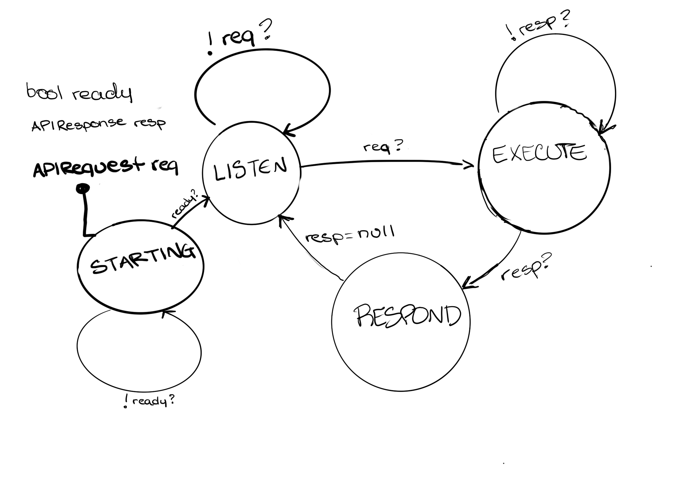
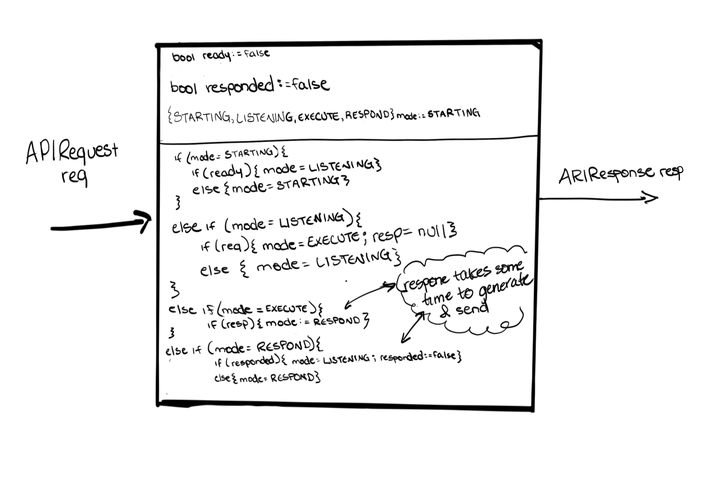

# [Agents (e.g., NCPA)](https://icinga.com/docs/icinga-2/latest/doc/07-agent-based-monitoring/)

In order to remotely monitor the statuses of services that are not directly accessible via the network, one installs an agent on the target host being monitored that opens up a standard API for querying the statuses of closed-off services on the host. Luckily, there is a fantastic agent called the [Nagios Cross Platform Agent](https://www.nagios.org/ncpa/) that, when installed, opens up a standard API that functions exactly the same across WQindows, Linux, and Mac. The specifics of the agent functionality will largely be abstracted for this model checking, but know that NCPA is the context we are using when discussing agent-based monitoring.

## Modeling

In the big picture, an agent is simply another service running on a host that listens indefinitely for requests from satellites for information about its host and/or services on its host. It does this by opening up an API that a satellite can query via an HTTP request; when the agent receives a request, it must spend some amount of time processing that request to produce a response payload, then some amount of time sending the response payload back to the satellite (requestor). After this, it goes back to listening for more requests.

Below I've modeled an agent as an extended state machine. Note that I have abstracted away the details of the request and response payloads. For this model check, I am interested not in whether the satellite sends a properly formed request nor whether the agent sends a properly formed response payload (the assumption is that both of these are properly constructed), but whether the transitions of the agent between listening, executing, responding, and listening take place as expected in relation to the agent's state variables. If one wishes to consider invalid requests that would throw exceptions on the agent, one can also assume that the exception is handled by the execution state and the error message is included in the properly formed response payload.



Within the ESM, we have a state variable for the API request, the API response, and a boolean indicator of whether the agent is ready to listen. The agent starts out in (just that) a _STARTING_ state as it is being set up (via a .sh or a .bat script depending on OS), and when ready (i.e. _ready_=true), begins LISTENing. It listens until an API request (_req_) is received, then enters an EXECUTE state where it processes the request and produces an API response (resp). Once the response is ready, the agent moves to the RESPOND state where it sends that response back to the requestor. Now, the response state variable is cleared back out and the agent re-enters the LISTEN state, and this loop continues happening essentially until the agent is stopped or uninstalled.



The input-reaction-output flow for the agent is a bit more obvious than some of the other components; naturally, the request is the input, the response is the output, and everything in between is the reaction to the request (or lack thereof).

In the above reactive component model of the agent, we see the `APIRequest req` functioning as the input and the `APIResponse resp` functioning as the output. We see the `bool ready` initialized to `false` (since the agent is never ready immediately), `bool responded` initialized to `false` as well (since a new agent has never already responded on start), and `{STARTING, LISTENING, EXECUTEING, RESPONDING} mode` initialized to `STARTING` since that's the mode every agent starts in.
Within the reaction, we wrap the following logic: we stay in starting until ready, at which point we move to listening. We stay in listening until a request is received, at which point we move to executing and initialize the `APIResponse response` output to null. We stay in executing until that response is constructed and ready to be sent. At this point, we move to responding. We stay in responding until a response has been sent (`responded = true`). Once we've responded successfully, we reset `responded` to false and go back to listening.

## nuxmv

The nuXmv module for checking this model is [here](check.smv).

### Input

```
// modeled as its own module within nuxmv
APIRequest req;

```

### Output

```
// modeled as its own module within nuxmv
APIResponse resp;
```

### Initialization

```
// whether agent is ready to listen
bool ready := false;
// whether agent has responded to a given request
bool responded := false;
// which mode the agent is currently in as seen in ESM model
{STARTING, LISTENING, EXECUTING, RESPONDING} mode := STARTING;
```

### Specifications

1. An agent should never transition from `LISTENING` to `EXECUTING` until a `req` has been received
2. An agent should never transition from `EXECUTING` to `RESPONDING` until a `resp` is ready to be sent back
3. An agent should never transition from `STARTING` to `LISTENING` until it is `ready`
4. An agent should never transition from `RESPONDING` to `LISTENING` until a `resp` has been sent (`responded=true`)
5. An agent in `STARTING` mode should only ever transition to `STARTING` or `LISTENING` mode
6. An agent in `LISTENING` mode should only ever transition to `LISTENING` or `EXECUTING` mode
7. An agent in `EXECUTING` mode should only ever transition to `EXECUTING` or `RESPONDING` mode
8. An agent in `RESPONDING` mode should only ever transition to `RESPONDING` or `LISTENING` mode
