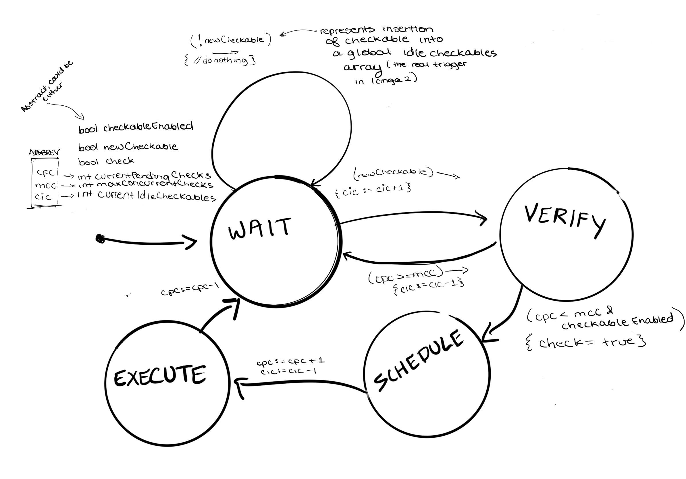
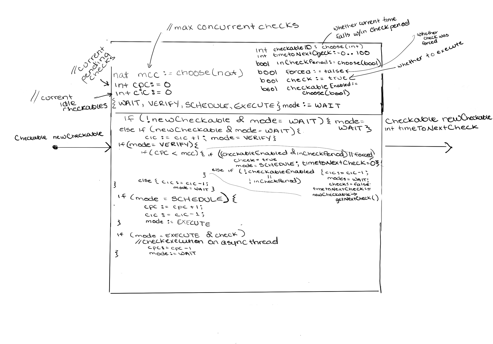

# [Check Scheduler](https://icinga.com/docs/icinga-2/latest/doc/19-technical-concepts/#technical-concepts-check-scheduler)

Of course if you have a system that's monitoring tons of hosts and services on your network, and needs to do so indefinitely, the scheduling of the checks against those hosts and services is an important factor.

Icinga 2 comes with a built-in **Check Scheduler**. In short, this component simply starts a thread that loops indefinitely. For the modeling of this component, we'll assume that the component has started and is in the loop so that we can focus on the inputs, the reactions, and the outputs as the loop runs.

The [documentation](https://icinga.com/docs/icinga-2/latest/doc/19-technical-concepts/#technical-concepts-check-scheduler) does not really frame the explanation of the Check Scheduler in a way that can be easily translated into a reactive component model, but we do have some details to work with.

## Modeling

We know that there is a configurable maximum for the number of concurrent check attempts, which we'll simply call `maxConcurrentCheckAttempts` (abbreviated `mcc` in the component model). On that same note, at any given time, there is a current number of pending checks, which we'll call `currentPendingCheckAttempts`. Based on the documentation linked above, I extrapolated a set of core "modes" / "states" that describe the main areas of functionality for the Check Scheduler: WAITING, VERIFYING, SCHEDULING, and EXECUTING. The WAITING state is the state in which the scheduler is waiting for new checkables to be inserted into a global `m_IdleCheckables` list of checkables. Upon that trigger, it begins running some meta-checks, if you will, to determine whether to go ahead and execute that check or to schedule it for later. Based on certain properties of the checkable object (which I've represented using `MODULE checkableModule` in the [check.smv](check.smv) file, the scheduler is able to either move forward with executing a check against that checkable immediately, or scheduling a check at a later time using the checkable's default time to next check. Below is an extended state machine depiction of this component with a lot of details abstracted.

In the ESM, we have our four main states functioning as the ESM modes, and we have some state variables representing information about the checkable for a given round of execution (i.e. is it present? is it enabled? should it be executed?) as well higher level information like how many check attempts are currently pending and what the maximum concurrent number of check attempts is. There is also a state variable for the current number of idle checkables, which is the number of checkables that have been staged for scheduling (i.e. have passed the WAITING state and entered VERIFY).
To summarize, the scheduler continues waiting (WAIT) until a new checkable arrives (does nothing until then). When a new checkable arrives, it increments the idle checkable count by 1 and enters the VERIFY state. From there, if the current pending check attempts count matches or exceeds the maximum number of concurrent check attempts, the check does not get executed and the scheduler re-enters the waiting mode (and the idle checkables count gets decremented again). Alternatively if the current pending check attempts count is below the maximum concurrent check attempts AND the checkable is enabled, we set check = true (execute now) and move to SCHEDULE. After some additional thought and experimenting, I've decided to actually remove this state entirely and skip directly to EXECUTE since SCHEDULE doesn't have any unique functionality or logic. So, we instead move to EXECUTE and increment the current pending check attempts count by 1, and decrement the idle count by 1. One very important thing to note that threw a significant wrench into this model is that the execution of a check against a checkable happens asynchronously. This of course makes a lot of sense, because if the executions were not asynchronous then the performance of the monitoring system would be significantly worse. Regardless, after setting the time until the next check equal to 0 (zero) seconds and outputting that, this component goes back to WAITing. Meanwhile, a different component asynchronously executes the check at the time specified by the timeToNextCheck, after which it re-decrements the pending check count.

Below is a slightly polished reactive component model of the scheduler:


This model provides a bigger picture view of the input (a checkable object), the internal states and reactions to that input, and the outputs (the checkable and the time until the next check against it). This one reflects some additional variables associated with a given checkable, i.e. is the check against it being forced? is the check period for that checkable currently active? how long until the next check? We simply use another state variable `mode` to indicate which state/mode we're currently in, corresponding to the modes from the ESM. Again, it stays in WAIT until a new checkable is present, at which point it goes to VERIFY and increments the idle count. When in VERIFY, if the current pending check attempts versus maximum comparison is satisfied, it then checks if either (the checkable is enabled for checks **and** its check period is currently active) **or** the check is _forced_ to determine whether to execute that check now. If it can't execute now, it sets the time to next check equal to the checkable's default and goes back to WAIT. Otherwise, it sets time to next check equal to 0 (zero) and enters the SCHEDULE mode (which could just as easily be the EXECUTE mode by shifting the assignments from the SCHEDULE block into EXECUTE). The current pending check attempts are incremented and the current idle checkables are decremented. The time to next check gets outputted in combination with the checkable and from there the execution is handled asynchronously by a different component; after execution completes, that component must re-decrement the current pending check count by 1.

## nuxmv

The nuXmv module for checking this model is [here](check.smv).

### Input

```
// Scheduler waits for checkables being inserted into m_IdleCheckables ; using a module in nuXmv to encapsulate information about checkable
Checkable newCheckable;

```

### Output

```
// output the same checkable that triggered the scheduler logic and include the time until
// the next check in seconds
// these values should be passed to a different component able to handle the check execution
// at the indicated time
Checkable newCheckable;
int timeToNextCheck;
```

### Initialization

```
// initialize max concurrent checks to some natural number
nat mcc := choose(nat)
// initialize current pending checks to 0
int cpc := 0
// initialize current idle checkables to 0
int cic := 0
// modes from ESM ; init to WAIT
{WAIT, VERIFY, SCHEDULE, EXECUTE} mode := WAIT

// ignore checkableID, ignore check - these can be abstracted

// ignore forced, checkableEnabled, inCheckPeriod - these can be abstracted
// as properties of the input checkable object
// (accessible in nuxmv with checkable.property; no need to define as local state variables)

// initialize time to next check to 0 seconds
int timeToNextCheck := 0 ..
```

### Update

```
if (!newCheckable & mode = WAIT) { mode = WAIT }
else if (newCheckable & mode = WAIT) { cic := cic + 1; mode = VERIFY; }
if (mode = VERIFY) {
    if (cpc < mcc) {
        if ( (newCheckable.enabled & newCheckable.inCheckPeriod) | forced) ) {
            mode = EXECUTE; timeToNextCheck = 0;
        } else {
            cic := cic - 1; mode := WAIT; timeToNextCheck := newCheckable.timeToNextCheck;
        }
    } else {
        cic := cic - 1; mode := WAIT;
    }
}
if (mode = EXECUTE) {
    // shift SCHEDULE mode logic into this mode; remove SCHEDULE
    cpc := cpc + 1; cic := cic - 1; mode := WAIT;
}
// output checkable, timeToNextCheck; another module will need to execute and re-decrement the cpc
```

### Specifications

1. Scheduler should not ever trigger execution of a check on a checkable not currently in its check period unless the check is forced
2. Scheduler should not ever trigger execution of a check that is not currently enabled unless the check is forced
3. Scheduler should not ever allow current pending checks for a checkable to exceed the maximum concurrent checks configured by the system admin
4. Scheduler should always add to the current idle checkables when a new checkable arrives
5. Scheduler should always enter a verification mode after a new checkable arrives before making scheduling or execution decisions
6. Scheduler should always decrement the current idle checkables and increment the current pending checkables when beginning execution of a check on that checkable
7. Scheduler should always decrement the current pending checkables when execution of a check against a checkable completes
8. Scheduler should always set time to next check equal to zero if checks on the checkable are currently enabled and the current check period for that checkable is active
9. Scheduler should always set time to next check equal to the checkable's "next check" setting if checks on the checkable are currently not enabled or the current check period for that checkable is not yet active
