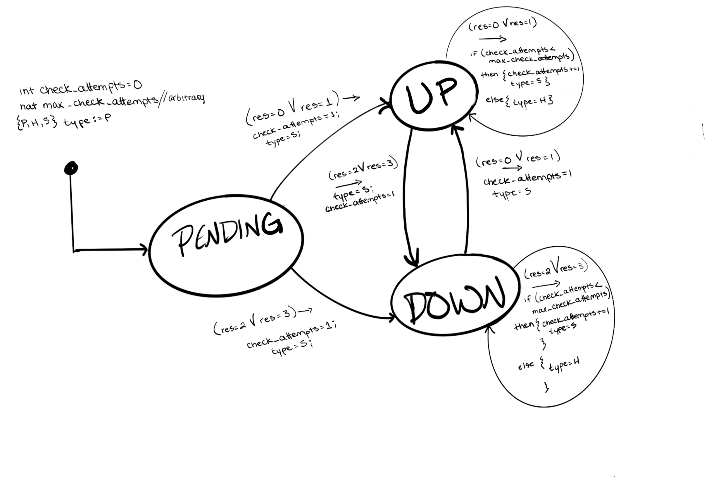

# [Host Checks](https://icinga.com/docs/icinga-2/latest/doc/03-monitoring-basics/#hosts-and-services)

A Host check is really just a check to ensure that a host is still alive, which equates to a ping against the target host (ICMP echo reques). In general, each host runs an agent for monitoring, e.g. NCPA for this case study. This `hostalive` check runs against all hosts, at a frequency of 1 check per minute. It can be disabled for certain hosts if they're not pingable, but for this case study, all hosts considered are pingable. Each host has an address (domain name or IP) and belongs to some [zone](../README.md). The zone of the host (e.g. the USA zone or the EU zone in the main README example diagram) tells the master which satellite(s) is/are responsible for that host and thus which satellite to send the hostalive (ping) check command to for execution. E.g. Master would send a hostalive check command to the USA satellite for execution against the USA 1 host (agent).

Once a host check is configured, you are able to monitor the real-time status (1 check per minute is very close to real-time) of the respective host. A host, when initially configured, is in a PENDING state. Once the check begins executing and returning a response, the response codes 0, 1, 2, 3 from the satellite indicate respectively the host states of UP and DOWN. More specifically, **0 and 1 indicate UP** and **2 and 3 indicate DOWN**. PENDING doesn't have a corresponding response code.

## Modeling

We know that a host can be in the states **PENDING, UP, and DOWN**. Let's define a map between host check response codes and host states (when a given code is returned from a check it triggers the host's entry into the respective state). For the model, we can consider the response code `res` to be an input to the service that triggers the service state change.

| Check Result Code | Host Enters State: |
| ----------------- | ------------------ |
| 0                 | UP                 |
| 1                 | UP                 |
| 2                 | DOWN               |
| 3                 | DOWN               |

As with [Services](../service/service.md), there are also [`HARD` and `SOFT` states](https://icinga.com/docs/icinga-2/latest/doc/03-monitoring-basics/#hard-and-soft-states) to consider with host monitoring. Similar to [how these hard and soft states function for services](../service/service.md), when a host (`hostalive`) check returns a non-UP result (result code 2 or 3 seen in the above table), it doesn't immediately trigger a notification. Rather, the host entity enters a `SOFT` state and continues checking until the number of check attempts reaches the configurable `max_check_attempts` setting. At this point, if the response code for the host check is still the same bad value, the host enters a `HARD` state which will trigger the sending of a notification if one is configured for the new mode (UP or DOWN). The host will (should) then _stay_ in the `HARD` state in the same mode (UP/DOWN) until a different response code is received, at which point the mode switches, the state goes back to `SOFT`, and the number of check attempts resets to 1. Ultimately, the `SOFT` state acts as a buffer to prevent flooding notifications about transient host state changes (i.e., [flapping](https://assets.nagios.com/downloads/nagioscore/docs/nagioscore/3/en/flapping.html)).

The below image is a diagram of an arbitrary Icinga 2 host entity modeled as an extended state machine (ESM).



In this diagram, I've modeled the main host states (PENDING, UP, DOWN) as the ESM modes, and have added a few additional state variables (similar to the [ESM for the service entity](../service/service.md)): `int check_attempts`, `nat max_check_attempts`, and `{P, H, S} type`. `check_attempts` is an integer state variable ranging from 0 to `max_check_attempts` that is used to essentially delay the assignment of `type` to `H` (`HARD` state) after a mode switch. `max_check_attempts` is some arbitrary positive integer representing how many check attempts should be executed basically to confirm that the last mode switch is not transient (i.e. is worthy of a notification). Lastly, `type` is one of `P`, `H`, `S`, representing the either pending, `HARD` state, or `SOFT` state. It's only `P` initially to represent that the check is pending and neither `HARD` state nor `SOFT` state has been entered yet.

One limitation of this model is that it does not convey the relationship between the `type=[H,S]` assignment and the triggering of a notification. I initially added another mode, `ALERT`, which the system would transition to once the `type=H` assignment was made, but that was not an elegant solution because it widened the entire scope of the model. So, I constructed a different model: a reactive component model with a simple set of inputs, outputs, and state variables, where the outputs could be used as inputs to a separate notification component. The below diagram illustrates this new idea.


This reactive component model conveys the same assignments conveyed by the previous diagram but now also shows 1) the check result code `res` functioning as the input to the host entity, 2) the internal conditional state updates that depend on that input, and 3) the output of the resulting host mode (UP/DOWN) along with the `HARD` or `SOFT` state type that is a determining factor in whether notifications will be sent.

## nuxmv

The nuXmv module for checking this model is [here](check.smv).

### Input

```
// abstract the check result code out as an input to the host entity
{0, 1, 2, 3} res;

```

### Output

```
// output the type (hard or soft) and the current host mode ("state") for use by
// the notification component to determine whether to send a notification
{UP, DOWN} mode;
{ H, S} type;
```

### Initialization

```
// initialize check attempts to 0
int ca := 0
// initialize max check attempts to some arbitrary natural number
nat mca := choose(nat)
// initialize the mode tracker state variable to PENDING as
// no checks have run yet
{PENDING, UP, DOWN} prevMode := PENDING
```

### Update

```
// update the mode depending on res input
if res == 0 or res == 1 then mode := UP
else if res == 2 or res == 3 then mode := DOWN
// if new mode, reset check attempts and enter SOFT state
if mode != prevMode then {
    ca := 1; type := S;
}
else {
    // mode self loop; increment if max not reached yet
    // and stay in SOFT state
    if ca < mca then {
        ca := ca + 1; type := S;
    }
    // max reached; type is HARD; stay here until
    // different response code is returned
    else {
        ca := ca; type := H
    }
}
// update the mode tracker for next round
prevMode := mode;
// explicitly maintain the maximum check attempts variable
mca := mca;
```

### Specifications

- `check_attempts` should never exceed `max_check_attempts`
  - `INVARSPEC check_attempts <= max_check_attempts`
- a response code of 0 (`res=0`) or 1 (`res=1`) should trigger transition to **only** the `UP` mode
  - `res == 0 v res == 1 <-> next mode = UP`
- a response code of 2 (`res=2`) or 3 (`res=3`) should trigger transition to **only** the `DOWN` mode

  - `res == 2 v res == 3 <-> next mode = DOWN`

- host should stay in `SOFT` state until check attempts reaches max check attempts setting (if `check_attempts` is less than `max_check_attempts` then the state type must be `SOFT`)
- if `check_attempts` equals `max_check_attempts` and the current state type is `SOFT` and the response code is still the same then the _next_ state type should be `HARD`; the `type = HARD` assignment doesn't get made until that equality is true
  - `check_attempts = max_check_attempts & type = SOFT & res = prevRes -> next type = HARD`
- if the state type is `HARD` then `check_attempts` **must** equal the `max_check_attempts`
  - `type = HARD -> check_attempts = max_check_attempts`
- the check attempts should reset to 1 if the mode (UP/DOWN) changes;
  - `mode != prevMode -> next value of check attempts is 1`
- A host in `HARD` state should maintain its `HARD` state with its current `check_attempts` value until a different response code is returned triggering a mode switch (if a host is in the `HARD` state type with `check_attempts` equaling `max_check_attempts`, then the only possible next valuations for `(type, check_attempts)` are `(SOFT, 1)` or `(HARD, check_attempts)` )
