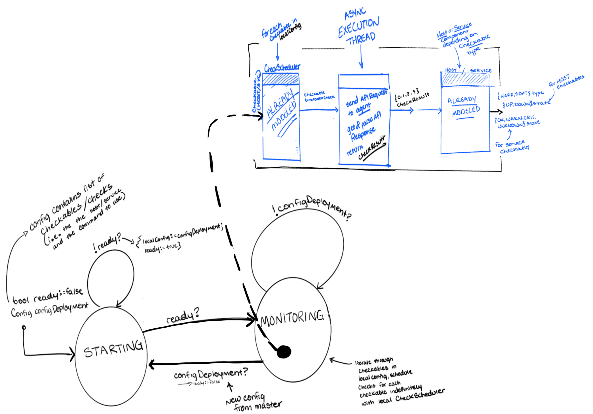
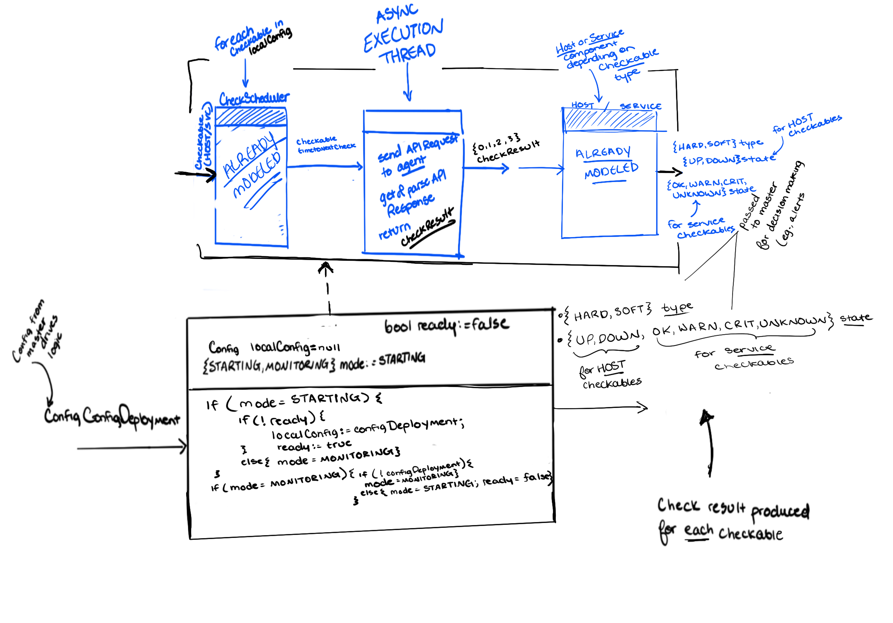

# [Satellite](https://icinga.com/docs/icinga-2/latest/doc/06-distributed-monitoring/#roles-master-satellites-and-agents)

As one might expect from a distributed monitoring platform, Icinga 2 can be configured in a multitude of ways, but I am going to make some assumptions and abstractions to simplify the construction and verification of a model for the satellite nodes. First and foremost, while a given instance of Icinga 2 may have a wide array of satellites handling the monitoring for a given zone (for redundancy and improved performance), I am going to focus the model on a single satellite node such that I can highlight core functionality of the singular satellite component rather than complex inter-relationships among various satellites (relationships = unnecessary & unwanted variables).
Also, as outlined in the documentation about [Icinga 2 Configuration Modes](https://icinga.com/docs/icinga-2/latest/doc/06-distributed-monitoring/#configuration-modes), I am going to construct a model based on a **Top Down Config Sync** architecture in which the Icinga 2 satellites receive all of their configuration from the [Master](../master) such that each satellite has its own independent [check scheduler](../checkscheduler/README.md) for their respective zone. This means you can, as a system admin, configure everything (all of the [host](../host/README.md) and [service](../service/README.md) checks) on the master and simply sync the to the satellites. The satellites, in turn, run their own local scheduler and send check result messages back to the master, which stores the results and presents them on a front end.

## Modeling

So, we already have a [verified model for the check scheduler](../checkscheduler/README.md), and we know a check scheduler runs on each satellite. This means we don't need to focus so much on the details of scheduling checks, but rather we can look at the input and output of the scheduler model and integrate that abstraction into this new model of a satellite. Specifically, we know that the scheduler takes as input a checkable object (host/service) and produces an output indicating the time until the next check for that checkable object. This is great, because for any given checkable host or service, the satellite knows what command to execute and what host to execute it against (i.e. it has the checkable) - it just needs to know when, and that information is provided by the scheduler model.



In the above extended state machine, I've depicted a model of a satellite node toggling between two main modes of operation: STARTING and MONITORING. With the top down config sync architecture, at a high level, a satellite simply takes a configuration deployment from the master as input, starts up with that configuration, and once ready, begins to continuously monitor its targets (the child [agents](../agent/README.md) in its zone) based on that deployed configuration. If and whenever the master deploys a new configuration (e.g. with a tool like [Icinga Director](https://icinga.com/docs/icinga-director/latest/doc/01-Introduction/)), the satellite goes back to STARTING, and essentially receives and applies that new deployment to its local config. The configuration contains information about the checkables that satellite is responsible for, so when the satellite goes back into MONITORING, what it is doing at a lower level is shown in the blue diagram. For each checkable host and service in its configuration (now local), the checkable is passed into the CheckScheduler, which outputs the proper time to check that checkable, which is passed into an asynchronous check execution thread. This thread essentially just takes the checkable, the appropriate time to check it, and executes that check in the form of an API request. Upon receiving the API response, it parses the check result (0, 1, 2, 3) and outputs that information, which translates into higher level output of the satellite node that propagates back to the master where decisions are made about that result.



As shown in the above reactive component description of the satellite, the basic flow is 1) the configuration deployment from the master is input into the satellite, 2) the satellite deploys that configuration by setting its local config to match it before restarting, and 3) the satellite continuously loops in the monitoring state until another change comes to its configuration from the master, all the while outputting the check result of each check it executes against the child agents in its zone. This lower-level execution is shown in the blue portion of the diagram, and is described above (it's the same blue diagram).

### Quick Note: Keeping Things Connected

So, big picture. Within a given satellite, we go from obtaining a checkable (host/service), to a scheduled check, to execution of that scheduled check, to a 0/1/2/3 check result for that checkable, which goes to a host or service entity that then outputs a combo of (HARD|SOFT) and (UP|DOWN for hosts; OK|WARN|CRIT|UNKNOWN for services). That last tuple of information then gets propagated back to the master where decisions are made about that state, i.e. alerts and whatnot.

## nuxmv

The nuXmv module for checking this model is [here](check.smv).

### Input

```
// configuration deployment from the master is input into the satellite at the will of the system administrator
// (whenever changes are made to config)
// this will be represented by its own abstract module in nuxmv for modeling purposes
Config configDeployment;
```

### Output

```
// a check result is produced for each and every enabled checkable within the configuration
// this output
{0, 1, 2, 3} checkResult;
```

### Initialization

```

```

### Update

```

```

### Specifications

- A satellite should always restart itself whenever a new configuration is deployed
- A satellite should always
