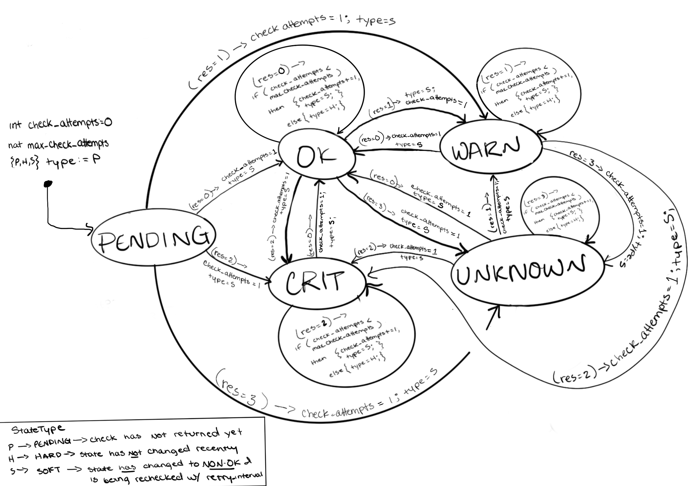

# [Service Checks](https://icinga.com/docs/icinga-2/latest/doc/03-monitoring-basics/#hosts-and-services)

When you monitor services in Icinga 2, you need to configure [service checks](https://icinga.com/docs/icinga-2/latest/doc/03-monitoring-basics/#hosts-and-services) for the services that you want to monitor. In a nutshell, when you set up a service check, you're not just checking if a host is up or down, you're checking whether that host is either running something correctly or performing as expected. A service check can be assigned to specific hosts via assignment rules that define host-matching criteria/conditions, e.g. host name == "_database-server_". This of course tells the master which hosts to target for the service check. Since each host belongs to some zone and a given satellite(s) is/are responsible for said zone, this tells the master which satellite to send the check command to.

Once a service check has been configured, you are able to monitor the status of the respective Service. A service, when initially configured, is in a PENDING state. Once the check begins returning responses, the response codes **0, 1, 2, and 3** from the satellite indicate respectively the service states of **OK, WARNING, CRITICAL, and UNKNOWN.**

## Modeling

We know that a given service can be in a set of states, **PENDING, OK, WARNING, UNKNOWN, CRITICAL**. Let's define a map between service check response codes and service states (when a given code is returned from a check it triggers the service's entry into the respective state). For the model, we can consider the response code `res` to be an input to the service that triggers the service state change.

| Check Result Code | Service Enters State: |
| ----------------- | --------------------- |
| 0                 | OK                    |
| 1                 | WARNING               |
| 2                 | CRITICAL              |
| 3                 | UNKNOWN               |

Now, we also have another set of states to consider: [`HARD` state versus `SOFT`](https://icinga.com/docs/icinga-2/latest/doc/03-monitoring-basics/#hard-and-soft-states) state. When a service check returns a non-OK result (1,2,3), it doesn't immediately trigger an notification. Instead, the service enters a `SOFT` state, and continues checking until the number of check attempts reaches the configurable `max_check_attempts` setting. At this point, if the response code is still the same, the service enters a `HARD` state. `HARD` state entry ultimately triggers the sending of an notification if one is configured for the new mode (OK, WARN, CRIT, UNKNOWN). The service will (should) stay in the `HARD` state in the same mode until a different response code is received, at which point the mode switches, the `check_attempts` variable resets to 1, and the service enters `SOFT` state again. Big picture: `SOFT` state acts as a buffer to prevent flooding notifications about transient service state changes (i.e., [flapping](https://assets.nagios.com/downloads/nagioscore/docs/nagioscore/3/en/flapping.html)).

The below image is a diagram of an arbitrary Icinga 2 service entity modeled as an extended state machine (ESM).



In this diagram, I've modeled the main service states as the ESM modes, and we have a few additional state variables: `int check_attempts`, `nat max_check_attempts`, and `{P, H, S} type`. `check_attempts` is an integer state variable ranging from 0 to `max_check_attempts` that is used to essentially delay the assignment of `type` to `H` (`HARD` state) after a mode switch. `max_check_attempts` is some arbitrary positive integer representing how many check attempts should be executed basically to confirm that the last mode switch is not transient (i.e. is worthy of a notification). Lastly, `type` is one of `P`, `H`, `S`, representing the either pending, `HARD` state, or `SOFT` state. It's only `P` initially to represent that the check is pending and neither `HARD` state nor `SOFT` state has been entered yet.

Having started with the above ESM diagram, I began pondering how to convey that the assignment of `type=[H,S]` actually triggers some sort of notification action. I initially added another mode, `ALERT`, which the system would transition to once the `type=H` assignment was made, but that was not an elegant solution because it widened the entire scope of the model. After this, I considered a different model. Rather than modeling the service as the ESM above, I could instead model it as a reactive component with a simple set of inputs, outputs, and state variables, where the outputs could be used as inputs to a separate notification component. The below diagram illustrates this new idea.


Now, the model is not only simpler, but conveys a bit more information. A service entity within Icinga 2 takes as **input** the result of the last check execution (executed by the satellite responsible for it). Then, it uses some internal state variables `ca` (shortened version of the previous `check_attempts` variable), `mca` (shortened version of the previous `max_check_attempts`), and `prevMode` which can be one of `{PENDING, OK, WARN, CRIT, UN}` that is basically used as an indicator of a mode switch in order to reset `check_attempts`. Then, it outputs the state type (`HARD` or `SOFT`) and the mode (one of `{OK, WARN, CRIT, UN}`) for use by a notification component. It outputs these variables because a notification (if enabled and configured for a service) should only be sent for a given mode when the state type is `HARD`.

## nuxmv

The nuXmv module for checking this model is [here](check.smv).

### Input

```
// abstract the check result code out as an input to the service
{0, 1, 2, 3} res;
```

### Output

```
// output the type (hard or soft) and the current service mode
// ("state") for notification component to determine whether
// to send a notification
{OK, WARN, CRIT, UN} mode;
{ H, S} type;
```

### Initialization

```
// initialize check attempts to 0
int ca := 0
// initialize max check attempts to some arbitrary natural number
nat mca := choose(nat)
// initialize the mode tracker state variable to PENDING
// as no checks have run yet
{PENDING, OK, CRIT, WARN, UN} prevMode := PENDING
```

### Update

```
// update current mode based on check result code
if res == 0 then mode := OK
else if res == 1 then mode := WARN
else if res == 2 then mode := CRIT
else if res == 3 then mode := UN
// if mode changed reset check attempts and go back to soft state
if mode != prevMode then {ca := 1; type := S}
else {
    // mode did not change; if max not reached, increment check attempts and keep soft state
    if ca < mca then { ca := ca + 1; type := S}
    // max was reached; set to hard state, maintain value of check attempts
    else { ca := ca; type := H}
}
prevMode := mode; // update mode tracker for next round
mca := mca; // explicitly maintain value of max check attempts
```

### Specifications:

- `check_attempts` should never exceed `max_check_attempts`
  - `INVARSPEC check_attempts <= max_check_attempts`
- a response code of 0 (`res=0`) should trigger transition to **only** the `OK` mode
  - `res == 0 <-> next mode = OK`
- a response code of 1 (`res=1`) should trigger transition to **only** the `WARN` mode
  - `res == 1 <-> next mode = WARN`
- a response code of 2 (`res=2`) should trigger transition to **only** the `CRIT` mode
  - `res == 2 <-> next mode = CRIT`
- a response code of 3 (`res=3`) should trigger transition to **only** the `UNKNOWN` mode
  - `res == 3 <-> next mode = UNKNOWN`
- service should stay in `SOFT` state until check attempts reaches max check attempts setting (if `check_attempts` is less than `max_check_attempts` then the state type must be `SOFT`)
- if `check_attempts` equals `max_check_attempts` then the _next_ state type should be `HARD`; the `type = HARD` assignment doesn't get made until that equality is true

  - `check_attempts == max_check_attempts -> next type = HARD`

- if the state type is `HARD` then `check_attempts` **must** equal the `max_check_attempts`
  - `type = HARD -> check_attempts = max_check_attempts`
- the check attempts should reset to 1 if the mode (service state; OK, WARN, CRIT, UNKNOWN) changes;
  - `mode != prevMode -> next value of check attempts is 1`
- A service in `HARD` state should maintain its `HARD` state with its current `check_attempts` value until a different response code is returned triggering a mode switch (if a service is in the `HARD` state type with `check_attempts` equaling `max_check_attempts`, then the only possible next valuations for `(type, check_attempts)` are `(SOFT, 1)` or `(HARD, check_attempts)` )
